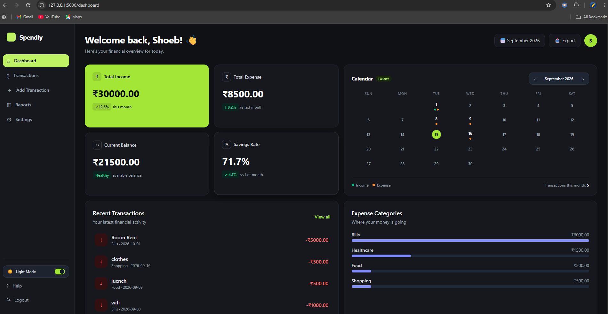
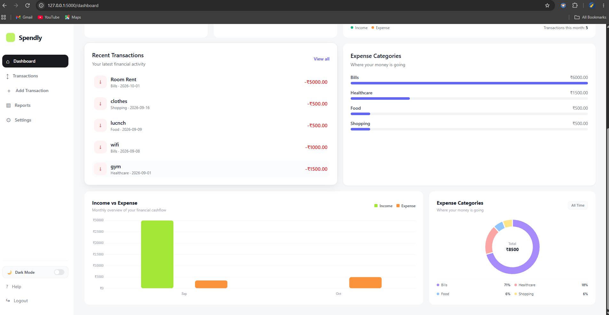
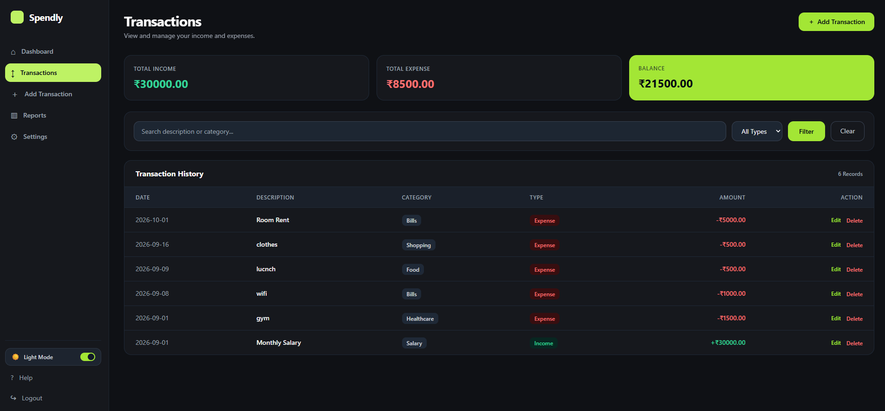
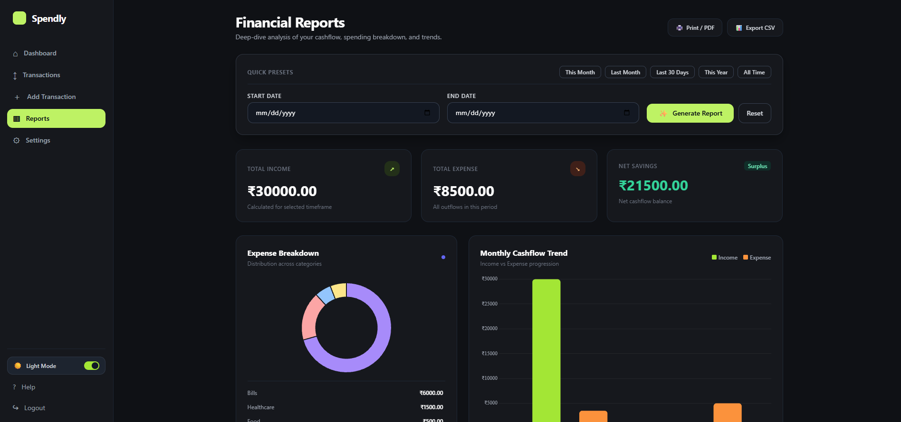
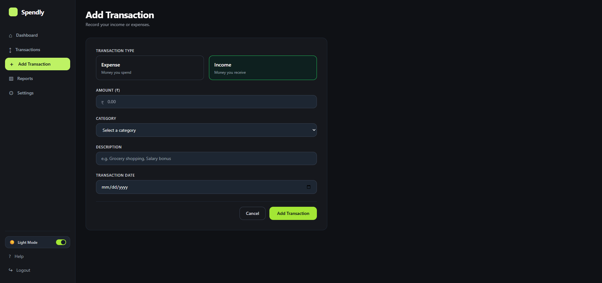
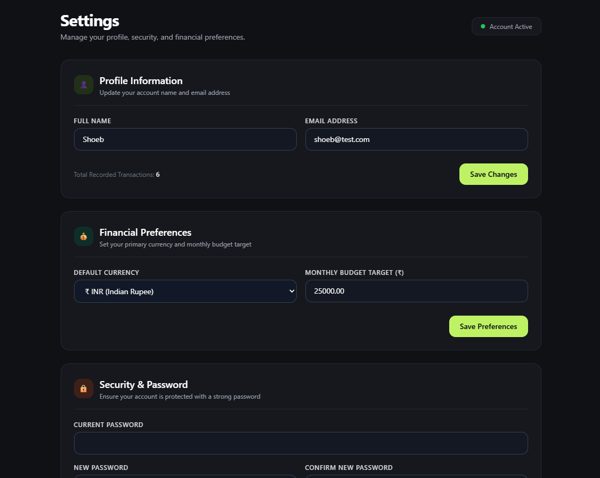
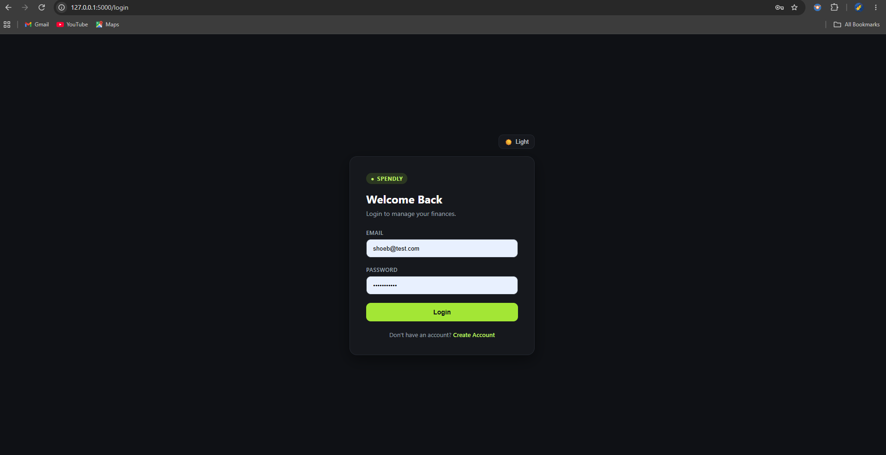
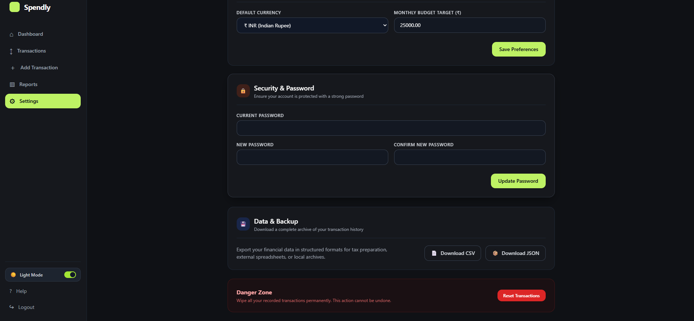
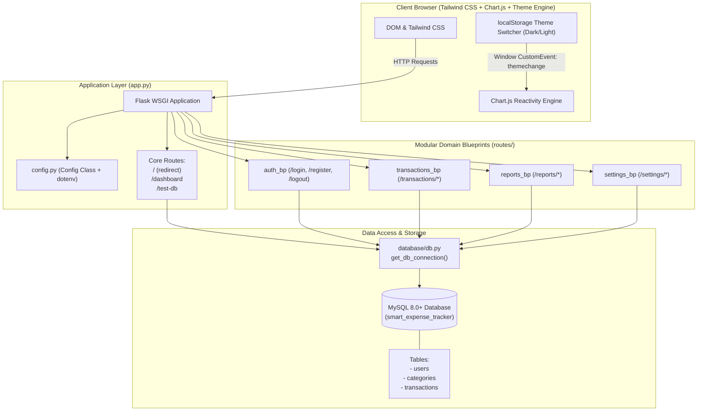
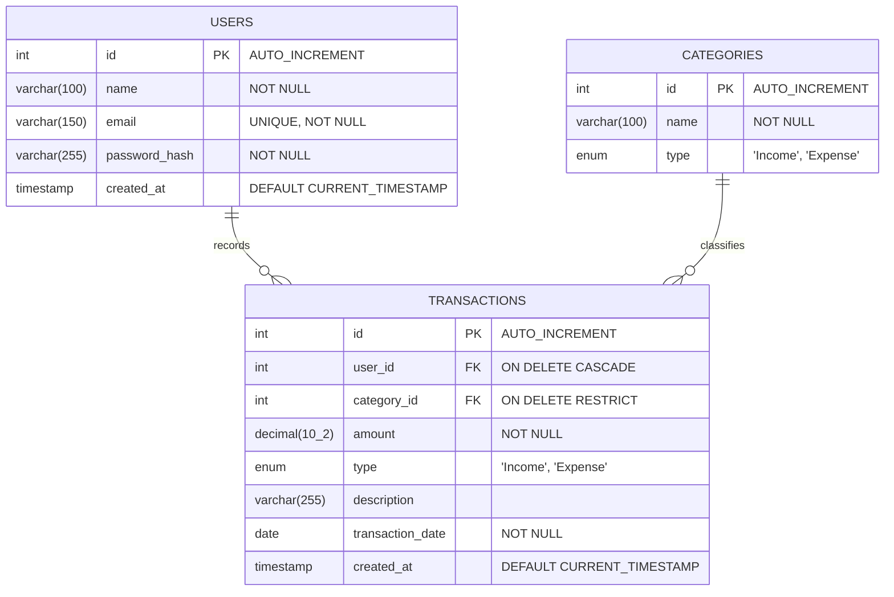

# Spendly — Smart Expense Tracker

> A high-performance, dark-mode first personal finance and cashflow management web application built with Python Flask and MySQL.

[](https://www.python.org/)
[](https://flask.palletsprojects.com/)
[](https://www.mysql.com/)
[](LICENSE)
[](#features)

---

## Visual Showcase

| Executive Dashboard (Dark Mode) | Visual Analytics & Dual Chart (Light Mode) |
| :---: | :---: |
|  |  |

| Transactions Ledger & Filter Engine | Financial Reports & Presets |
| :---: | :---: |
|  |  |

| Add Transaction Modal / Form | Settings Hub & Data Export |
| :---: | :---: |
|  |  |

| Secure Authentication & Theme Engine | Data Backups & Danger Zone |
| :---: | :---: |
|  |  |

---

## Overview

**Spendly** is an executive-grade personal finance platform engineered to bridge the gap between simple spreadsheet tracking and complex enterprise budgeting software. Built around a hybrid modular Flask architecture and high-performance parameterized MySQL queries, Spendly delivers instant financial awareness through responsive Chart.js visual analytics, dynamic calendar event maps, granular category budgeting, multi-format data exports (CSV & JSON), and a zero-FOUC Obsidian/Lime dark theme system.

---

## Codebase-Authentic Architecture

Spendly uses a **hybrid modular pattern**: high-traffic aggregated analytical entry points (`/dashboard`, `/`) are managed at the core application layer, while discrete business domains are isolated into dedicated Flask Blueprints. The data layer communicates directly with MySQL via `mysql-connector-python` using clean, parameterized queries and connection lifecycle controls.



---

## Implemented Route & Blueprint Topology

| Endpoint Name | HTTP Rule | Methods | Implementation Handler | Business Capability |
| :--- | :--- | :--- | :--- | :--- |
| `home` | `/` | `GET` | `app.py:home` | Auto-redirects unauthenticated users to `/login` |
| `dashboard` | `/dashboard` | `GET` | `app.py:dashboard` | KPI cards, dual cashflow bar chart, category donut, calendar event map |
| `test_db` | `/test-db` | `GET` | `app.py:test_db` | Health-check probe verifying MySQL socket connectivity |
| `auth.register` | `/register` | `GET`, `POST` | `routes/auth.py:register` | User onboarding with Werkzeug SHA-256 password hashing |
| `auth.login` | `/login` | `GET`, `POST` | `routes/auth.py:login` | Authenticates email/password, creates session tokens |
| `auth.logout` | `/logout` | `GET` | `routes/auth.py:logout` | Clears user session dictionary and flashes exit message |
| `transactions.list_transactions` | `/transactions/` | `GET` | `routes/transactions.py:list_transactions` | Search by keyword, filter by Type/Category/Date, pagination |
| `transactions.add_transaction` | `/transactions/add` | `GET`, `POST` | `routes/transactions.py:add_transaction` | Records new income or expense transaction with date & category |
| `transactions.edit_transaction` | `/transactions/edit/<id>` | `GET`, `POST` | `routes/transactions.py:edit_transaction` | Edit historical transaction values, date, or category |
| `transactions.delete_transaction` | `/transactions/delete/<id>` | `POST` | `routes/transactions.py:delete_transaction` | Hard-delete transaction with user ownership validation |
| `reports.reports` | `/reports/` | `GET` | `routes/reports.py:reports` | Analytical deep-dive with quick presets, progress bars, and table |
| `settings.index` | `/settings/` | `GET` | `routes/settings.py:index` | Account settings, statistics, preferences, and data tools |
| `settings.update_profile` | `/settings/profile` | `POST` | `routes/settings.py:update_profile` | Updates full name and email with duplicate email check |
| `settings.update_preferences` | `/settings/preferences` | `POST` | `routes/settings.py:update_preferences` | Configures currency symbol (`₹`, `$`, `€`, `£`, `¥`) & monthly budget |
| `settings.change_password` | `/settings/password` | `POST` | `routes/settings.py:change_password` | Password rotation with current password verification |
| `settings.export_csv` | `/settings/export/csv` | `GET` | `routes/settings.py:export_csv` | Streaming CSV download of complete user transaction archive |
| `settings.export_json` | `/settings/export/json` | `GET` | `routes/settings.py:export_json` | Structured JSON archive export |
| `settings.reset_data` | `/settings/reset` | `POST` | `routes/settings.py:reset_data` | Password-gated purge of all transactions for the user |

---

## Features Grounded in Code

- **Executive KPI Dashboard (`/dashboard`)**:
  - Live calculations for Total Income, Total Expenses, Net Savings Balance, and dynamic Savings Percentage.
  - Interactive calendar engine with backward/forward month navigation, activity dots (green for Income, orange for Expense), and a day-details modal with direct `+ Add on this day` action.
  - Animated dual-bar monthly cashflow trend chart and donut chart with center totals.
- **Transaction Ledger (`/transactions/`)**:
  - Real-time search query filtering over transaction descriptions and category names.
  - Type-filtering (`Income`, `Expense`, or `All Types`).
  - Interactive table with category and type badge tags, formatted currency values, and actions.
- **Financial Reports Engine (`/reports/`)**:
  - 1-click Quick Presets: *This Month*, *Last Month*, *Last 30 Days*, *This Year*, *All Time*.
  - Smooth animated "Generating..." UI transition button with spinner.
  - Visual breakdown doughnut chart and monthly comparison bar graph.
  - Category percentage progress bars with CSS gradients.
  - Historical performance table and native Print / PDF trigger.
- **Comprehensive User Settings (`/settings/`)**:
  - Account Profile management (name & email verification).
  - Multi-currency switcher (`₹` INR, `$` USD, `€` EUR, `£` GBP, `¥` JPY).
  - Monthly budget threshold tracker.
  - Werkzeug-verified password rotation.
  - One-click structured exports in **CSV** and **JSON** formats.
  - Password-confirmed danger zone transaction reset.
- **System-Wide Dark Mode**:
  - Zero-FOUC execution via inline `<head>` detection of `localStorage` and `prefers-color-scheme`.
  - Bespoke obsidian (`#0f1115`) and charcoal (`#16181d`) palette accented with Spendly Lime (`#a3e635`).
  - Dynamic Chart.js theme reactivity via custom `themechange` event listeners.

---

## Database Schema

> **Architectural Audit Note**: This repository bypasses heavy ORM overhead (such as Flask-SQLAlchemy) in favor of high-throughput direct parameterized queries using `mysql-connector-python`. Schema constraints and referential integrity are enforced at the database engine level (`database/schema.sql`).



### Table Definitions

1. **`users`**:
   - `id`: `INT AUTO_INCREMENT PRIMARY KEY`
   - `name`: `VARCHAR(100) NOT NULL`
   - `email`: `VARCHAR(150) NOT NULL UNIQUE`
   - `password_hash`: `VARCHAR(255) NOT NULL` (Werkzeug secure PBKDF2/SHA256)
   - `created_at`: `TIMESTAMP DEFAULT CURRENT_TIMESTAMP`

2. **`categories`**:
   - `id`: `INT AUTO_INCREMENT PRIMARY KEY`
   - `name`: `VARCHAR(100) NOT NULL`
   - `type`: `ENUM('Income', 'Expense') NOT NULL`
   - *Seeded with 11 default categories*: Salary, Freelance, Other Income, Food, Transport, Shopping, Bills, Entertainment, Healthcare, Education, Other Expense.

3. **`transactions`**:
   - `id`: `INT AUTO_INCREMENT PRIMARY KEY`
   - `user_id`: `INT NOT NULL` (Foreign Key referencing `users(id)` with `ON DELETE CASCADE`)
   - `category_id`: `INT NOT NULL` (Foreign Key referencing `categories(id)` with `ON DELETE RESTRICT`)
   - `amount`: `DECIMAL(10, 2) NOT NULL`
   - `type`: `ENUM('Income', 'Expense') NOT NULL`
   - `description`: `VARCHAR(255)`
   - `transaction_date`: `DATE NOT NULL`
   - `created_at`: `TIMESTAMP DEFAULT CURRENT_TIMESTAMP`

---

## Tech Stack

Derived directly from [`requirements.txt`](requirements.txt) and application assets:

- **Backend Framework**: [Flask 3.x](https://flask.palletsprojects.com/) (WSGI Microframework)
- **Database Driver**: [mysql-connector-python](https://dev.mysql.com/doc/connector-python/en/) (Official MySQL Oracle driver)
- **Environment & Config**: [python-dotenv](https://github.com/theskumar/python-dotenv)
- **Security & Hashing**: [Werkzeug](https://palletsprojects.com/p/werkzeug/) (`generate_password_hash`, `check_password_hash`)
- **Frontend UI Engine**: [Tailwind CSS CDN](https://tailwindcss.com/) with custom micro-animations (`@keyframes fadeInUp`, `.btn-hover`, `.card-hover`)
- **Data Visualization**: [Chart.js 4.x](https://www.chartjs.org/) (Dynamic Dual-Bar charts & Donut visualizers)
- **Runtime Environment**: Python 3.10+ / Windows PowerShell / MySQL 8.0+

---

## Local Development Setup (Windows PowerShell)

Follow these steps to run Spendly locally on Windows:

### 1. Clone & Open Repository
```powershell
git clone https://github.com/shoeb310/smart-expense-tracker.git
cd smart-expense-tracker
```

### 2. Create and Activate Virtual Environment
```powershell
# Create virtual environment
python -m venv venv

# Set PowerShell execution policy (if restricted) and activate
Set-ExecutionPolicy -ExecutionPolicy RemoteSigned -Scope Process
.\venv\Scripts\Activate.ps1
```

### 3. Install Dependencies
```powershell
pip install --upgrade pip
pip install -r requirements.txt
```

### 4. Configure Environment Variables (`.env`)
Create a `.env` file in the project root:
```ini
SECRET_KEY=your_super_secret_spendly_session_key_here
MYSQL_HOST=localhost
MYSQL_USER=root
MYSQL_PASSWORD=your_mysql_password
MYSQL_DATABASE=smart_expense_tracker
MYSQL_PORT=3306
```

### 5. Initialize Database Schema
Ensure your MySQL service is running, then execute the schema initialization script:
```powershell
# Using MySQL CLI
mysql -u root -p < database/schema.sql
```

### 6. Verify Database Connection & Run App
```powershell
# Run Flask development server
python app.py
```
Open your browser and navigate to:
- App Interface: **`http://127.0.0.1:5000/`**
- DB Connection Probe: **`http://127.0.0.1:5000/test-db`**

---

## Future Roadmap

- [ ] **Recurring Transactions**: Automated scheduler for recurring monthly bills, subscriptions, and salaries.
- [ ] **Multi-Account / Wallets**: Track distinct accounts (Bank Account, Cash, Credit Card, Investment).
- [ ] **Receipt OCR Scanning**: Automatic expense itemization from uploaded invoice and receipt images.
- [ ] **Budget Alerts**: Email/in-app notifications when an expense category surpasses 80% and 100% of target budget.
- [ ] **Database Migration Pipeline**: Integrate Alembic / Flask-Migrate for version-controlled schema migrations.

---

## License

This project is licensed under the MIT License — see the [LICENSE](LICENSE) file for details.
